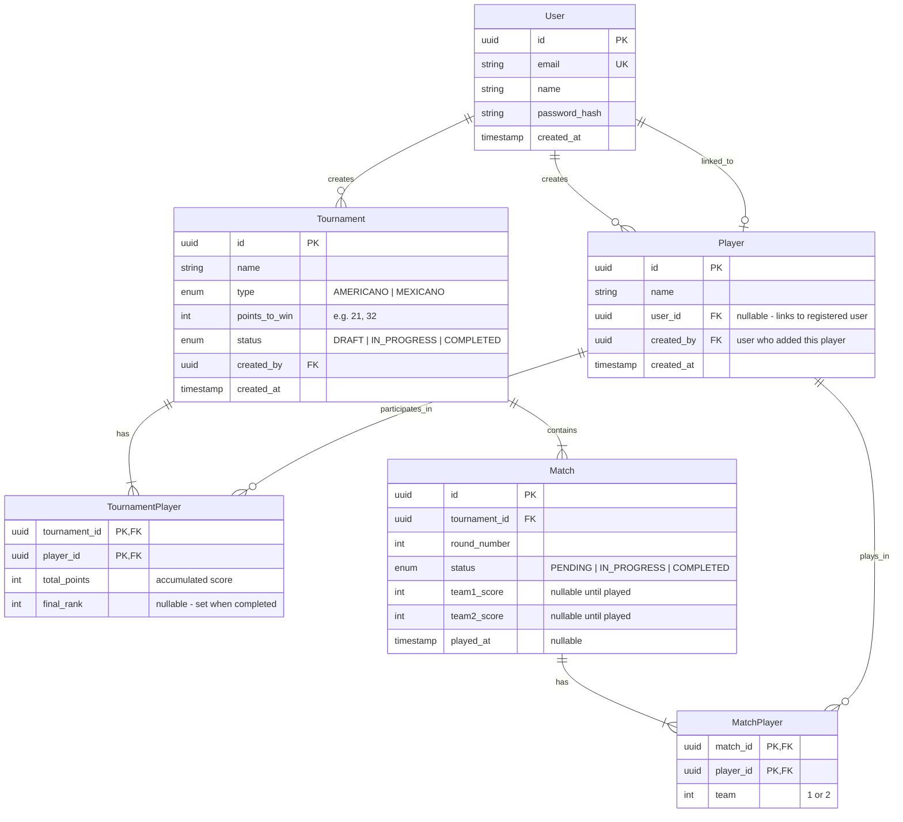

# Padel Tournament App - ER Diagram

```mermaid
erDiagram
    User {
        uuid id PK
        string email UK
        string name
        string password_hash
        timestamp created_at
    }

    Player {
        uuid id PK
        string name
        uuid user_id FK "nullable - links to registered user"
        uuid created_by FK "user who added this player"
        timestamp created_at
    }

    Tournament {
        uuid id PK
        string name
        enum type "AMERICANO | MEXICANO"
        int points_to_win "e.g. 21, 32"
        enum status "DRAFT | IN_PROGRESS | COMPLETED"
        uuid created_by FK
        timestamp created_at
    }

    TournamentPlayer {
        uuid tournament_id PK,FK
        uuid player_id PK,FK
        int total_points "accumulated score"
        int final_rank "nullable - set when completed"
    }

    Match {
        uuid id PK
        uuid tournament_id FK
        int round_number
        enum status "PENDING | IN_PROGRESS | COMPLETED"
        int team1_score "nullable until played"
        int team2_score "nullable until played"
        timestamp played_at "nullable"
    }

    MatchPlayer {
        uuid match_id PK,FK
        uuid player_id PK,FK
        int team "1 or 2"
    }

    %% Relationships
    User ||--o{ Tournament : "creates"
    User ||--o{ Player : "creates"
    User ||--o| Player : "linked_to"

    Tournament ||--|{ TournamentPlayer : "has"
    Player ||--o{ TournamentPlayer : "participates_in"

    Tournament ||--|{ Match : "contains"

    Match ||--|{ MatchPlayer : "has"
    Player ||--o{ MatchPlayer : "plays_in"
```